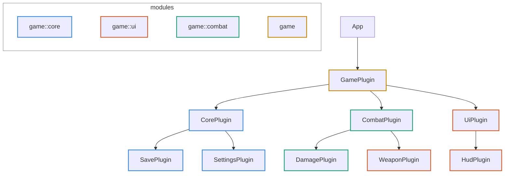

# bevy_plugin_graph

Records which Bevy plugin added which plugin, and renders the result as JSON or Mermaid.

**Added is the only thing we can unambiguously check.** An edge `A → B` means `A`'s
`build()` added `B`. Nothing about actual data flow is inferred or claimed.

## Usage

Swap `add_plugins` for `add_owned` at the call sites you want in the graph:

```rust
use bevy::prelude::*;
use bevy_plugin_graph::{AddOwned, PluginGraphPlugin};

fn main() {
    let mut app = App::new();
    app.add_plugins(DefaultPlugins);
    app.add_plugins(PluginGraphPlugin::new());
    app.add_owned(GamePlugin);
    app.run();
}

struct GamePlugin;

impl Plugin for GamePlugin {
    fn build(&self, app: &mut App) {
        app.add_owned(CombatPlugin);
        app.add_owned(UiPlugin);
    }
}
```

Then point it at a file:

```sh
BEVY_PLUGIN_GRAPH=graph.mmd cargo run     # Mermaid, from the extension
BEVY_PLUGIN_GRAPH=graph.json cargo run    # JSON
```

`PluginGraphPlugin::new().exit_after_dump()` quits before the runner starts, so
iterating on the graph of a windowed app doesn't mean closing a window each time.
To skip the plugin entirely, `bevy_plugin_graph::dump(&app, path, format)` works on
any built `App` — see `examples/game.rs`, which never calls `run()`.

## Output

Nodes are stroked by the module they are defined in. Here `WeaponPlugin` is defined
in `game::ui` but wired in by `CombatPlugin`, so it is the one node whose colour
differs from its neighbours:



That divergence is a question, not an error. Plugins and modules are orthogonal —
modules govern who can name what at compile time, plugins govern what gets wired in
at runtime — and there are good reasons to define several plugins in one module. The
graph points at candidates; you decide.

JSON is the real interface; Mermaid is one consumer of it.

## What it does not do

- **Plugins added with plain `add_plugins` are invisible.** Third-party plugins and
  `DefaultPlugins` do not appear. Only what you record is recorded.
- **No data-flow analysis, no linting, no violation report.** Bevy keeps per-system
  data access private (`SystemWithAccess::access` is `pub(crate)` with no public
  getter), so "who actually *uses* this component" is not answerable from outside.
- **Sub-apps are not traversed.** One graph corresponds to one Bevy `World`.

## Compatibility

| `bevy_plugin_graph` | `bevy` |
|---|---|
| 0.1 | 0.19 |

## Development

A Nix flake provides the toolchain:

```sh
nix develop      # or `direnv allow`, the .envrc is there
cargo test
cargo run --example game
```

`DESIGN.md` has the reasoning: why instrumentation rather than tracing or static
analysis, and what is deliberately out of scope.

## License

[MIT](LICENSE).
