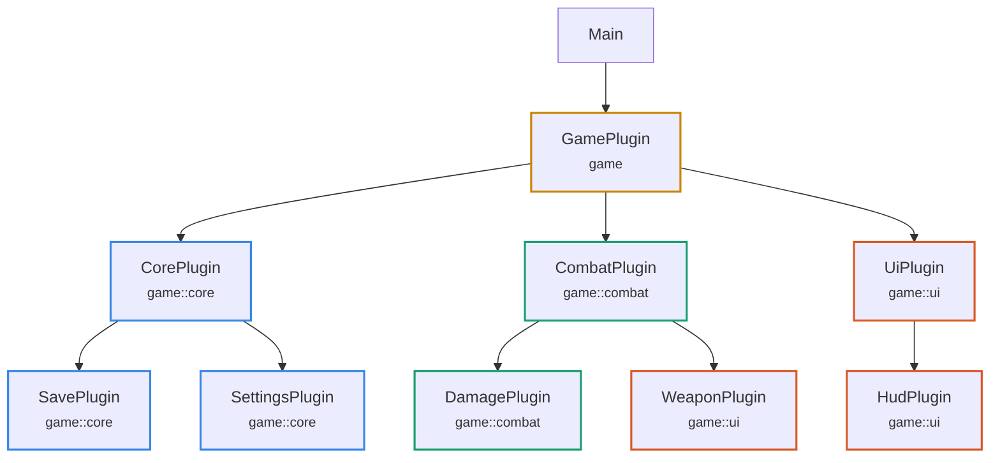

# bevy_plugin_graph

Records which Bevy plugin added which plugin, and renders the result as JSON or Mermaid.

**Added is the only thing we can unambiguously check.** An edge `A → B` means `A`'s
`build()` added `B`. Nothing about actual data flow is inferred or claimed.

## Usage

Name the root, swap `add_plugins` for `add_owned` at the call sites you want in
the graph, then dump before `run()`:

```rust
use bevy::prelude::*;
use bevy_plugin_graph::PluginGraphExt;

fn main() {
    let mut app = App::new();
    app.add_plugins(DefaultPlugins);
    app.init_graph("Main");
    app.add_owned(GamePlugin);

    app.dump_graph("graph.mmd").unwrap();
    app.run();
}

struct GamePlugin;

impl Plugin for GamePlugin {
    fn build(&self, app: &mut App) {
        app.add_owned(CombatPlugin);
        app.add_owned(UiPlugin);
    }
}
```

Recording is opt-in: `add_owned` only records into a graph `init_graph` created, so
call `init_graph` first — on a world without one, `add_owned` is exactly
`add_plugins`.

`build()` runs synchronously inside each add, so the graph is complete as soon as the
last add returns — no runner, no schedule, no `finish()` involved. That also means
*when* to dump is your policy, not the crate's. Gate it however you like, including
skipping `run()` entirely when all you want is the graph:

```rust
if std::env::var_os("DUMP_GRAPH").is_some() {
    app.dump_graph("graph.mmd").unwrap();
    return;
}
app.run();
```

`dump_graph` infers the format from the extension (`.mmd`/`.md` → Mermaid, anything
else → JSON) and inserts the root name into the file stem: `graph.mmd` becomes
`graph.Main.mmd`. For an exact path and explicit format, reach the graph itself:
`app.graph().unwrap().write("out.json", Format::Json)`.

## Sub-apps

One graph corresponds to one Bevy `World`, so each sub-app records its own, named
while you build it:

```rust
let mut render = SubApp::new();
render.init_graph("RenderApp");
render.add_owned(RenderPlugin);
app.insert_sub_app(RenderApp, render);
```

The whole API — `add_owned`, `init_graph`, `graph`, `dump_graph` — is one extension
trait, `PluginGraphExt`, implemented for `App` and `SubApp` alike. Reach a sub-app's
graph with `app.sub_app(RenderApp).graph()` (or, holding only a bare `World`, read
the `PluginGraph` resource directly). Dumping every world against the same base path
lands the roots side by side, never overwriting each other:

```
graph.mmd  →  graph.Main.mmd
              graph.RenderApp.mmd
```

## Output

Nodes are stroked by the module they are defined in, and each node carries its
module as a small note. Here `WeaponPlugin` is defined in `game::ui` but wired in
by `CombatPlugin`, so it is the one node whose colour differs from its neighbours:



That divergence is a question, not an error. Plugins and modules are orthogonal —
modules govern who can name what at compile time, plugins govern what gets wired in
at runtime — and there are good reasons to define several plugins in one module. The
graph points at candidates; you decide.

JSON is the real interface; Mermaid is one consumer of it.

## What it does not do

- **Plugins added with plain `add_plugins` are invisible.** Third-party plugins and
  `DefaultPlugins` do not appear. Only what you record is recorded.
- **No data-flow analysis, no linting, no violation report.** Bevy keeps per-system
  data access private (`SystemWithAccess::access` is `pub(crate)` with no public
  getter), so "who actually *uses* this component" is not answerable from outside.

## Compatibility

| `bevy_plugin_graph` | `bevy` |
|---|---|
| 0.1 | 0.19 |

## Development

A Nix flake provides the toolchain:

```sh
nix develop      # or `direnv allow`, the .envrc is there
cargo test
cargo run --example game
```

`DESIGN.md` has the reasoning: why instrumentation rather than tracing or static
analysis, and what is deliberately out of scope.

## License

[MIT](LICENSE).
