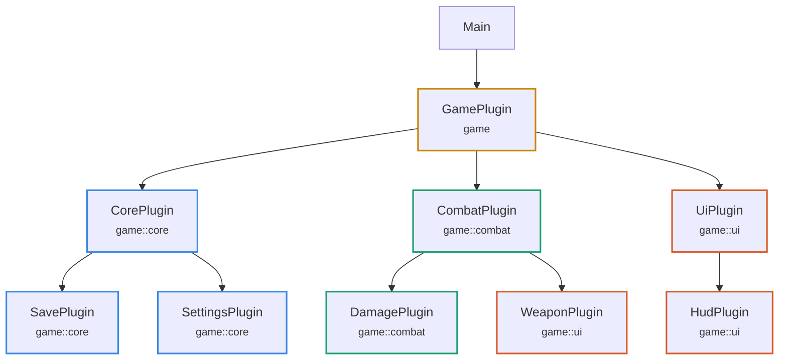

# bevy_plugin_graph

Records which Bevy plugin added which plugin, and renders the result as JSON or Mermaid.

The whole API is one extension trait on `App` and `SubApp`: `PluginGraphExt`, with
`init_graph`, `add_owned`, `graph`, and `dump_graph`.

## Usage

Name the root, swap `add_plugins` for `add_owned` at the call sites you want in
the graph, then dump before `run()`:

```rust
use bevy::prelude::*;
use bevy_plugin_graph::PluginGraphExt;

fn main() {
    let mut app = App::new();
    app.add_plugins(DefaultPlugins);
    app.init_graph("Main");
    app.add_owned(GamePlugin);

    app.dump_graph("graph.mmd").unwrap();
    app.run();
}

struct GamePlugin;

impl Plugin for GamePlugin {
    fn build(&self, app: &mut App) {
        app.add_owned(CombatPlugin);
        app.add_owned(UiPlugin);
    }
}
```

Then dump the graph like so:

```rust
if std::env::var_os("DUMP_GRAPH").is_some() {
    app.dump_graph("graph.mmd").unwrap();
    return;
}
app.run();
```

For more control, reach the graph itself:
```rust
app.graph().unwrap().write("out.json", Format::Json)
```

## Sub-apps

One graph corresponds to one Bevy `World`, so each sub-app records its own, named
while you build it:

```rust
let mut render = SubApp::new();
render.init_graph("RenderApp");
render.add_owned(RenderPlugin);
app.insert_sub_app(RenderApp, render);
```

## Output

Nodes are stroked by the module they are defined in, and each node carries its
module as a small note. Here `WeaponPlugin` is defined in `game::ui` but wired in
by `CombatPlugin`, so it is the one node whose colour differs from its neighbours:



## Compatibility

| `bevy_plugin_graph` | `bevy` |
|---|---|
| 0.1 | 0.19 |

## Development

A Nix flake provides the toolchain:

```sh
nix develop      # or `direnv allow`, the .envrc is there
cargo test
cargo run --example game
```

Refer to `DESIGN.md` for design reasoning.

## License

[MIT](LICENSE).
